# 🌊 Harmonia – Geospatial Platform for Intelligent Water Management

## 📌 Project Description

Harmonia is an innovative web application developed as part of the Final Year Project in Computer Engineering at Universidade Lusófona. The platform aims to support the efficient management of water resources, focusing on reservoirs, rivers, and agricultural zones, providing an integrated, visual, and predictive overview of the current hydrological situation.

By collecting and integrating both real-time and historical data (including satellite imagery, field measurements, and external APIs), the system offers dynamic visualizations, interactive dashboards, and personalized alerts based on machine learning models.

## Website Walkthrough

### Home Page

|                 Light Mode                 |                   Dark Mode                    |
| :----------------------------------------: | :--------------------------------------------: |
| 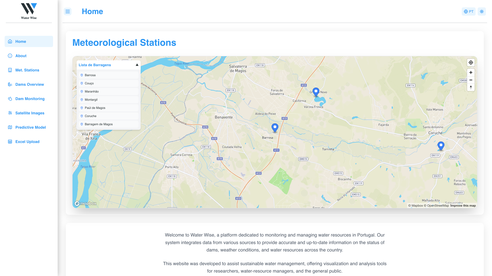 | 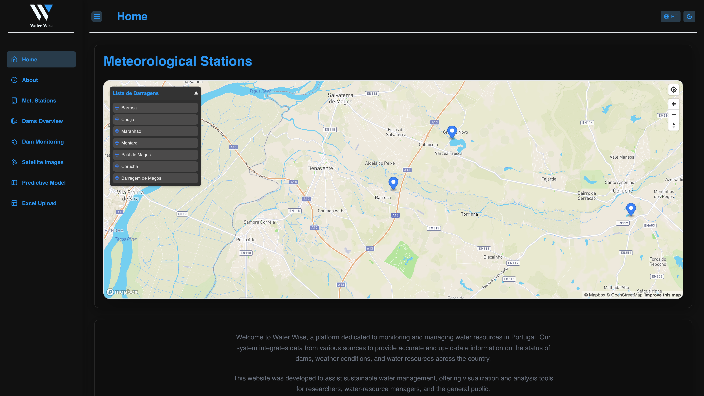 |

### About Page

|                  Light Mode                  |                    Dark Mode                     |
| :------------------------------------------: | :----------------------------------------------: |
| 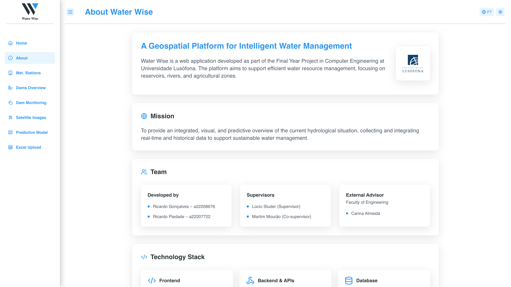 | 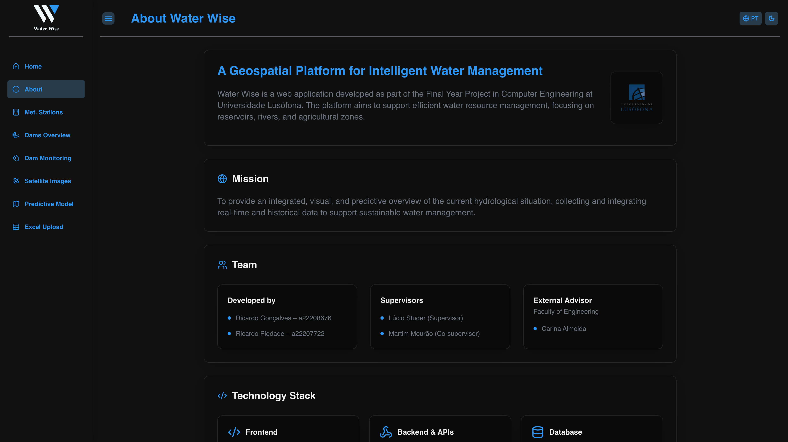 |

### Meteorological Stations Page

|                                    Light Mode                                    |                                      Dark Mode                                       |
| :------------------------------------------------------------------------------: | :----------------------------------------------------------------------------------: |
|  |  |

### Meteorological Station Page

|                                   Light Mode                                   |                                     Dark Mode                                      |
| :----------------------------------------------------------------------------: | :--------------------------------------------------------------------------------: |
| 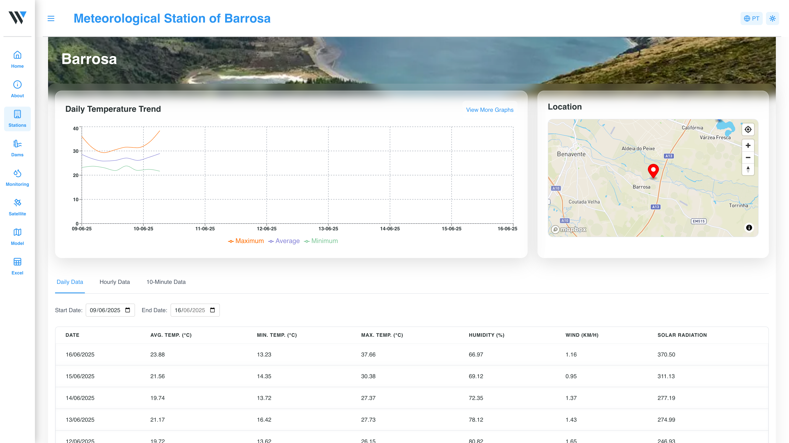 | 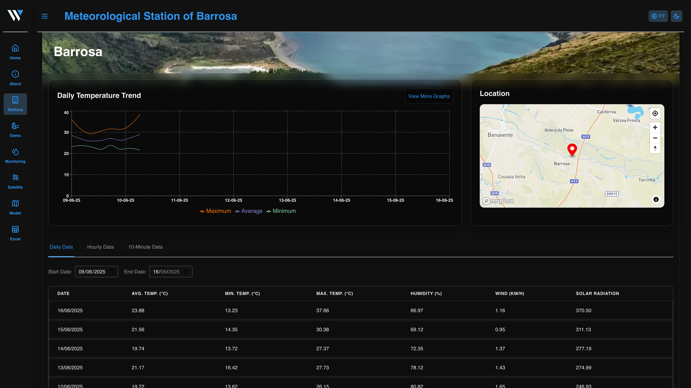 |

### Meteorological Station Graphs Page

|                                  Light Mode                                   |                                     Dark Mode                                     |
| :---------------------------------------------------------------------------: | :-------------------------------------------------------------------------------: |
| 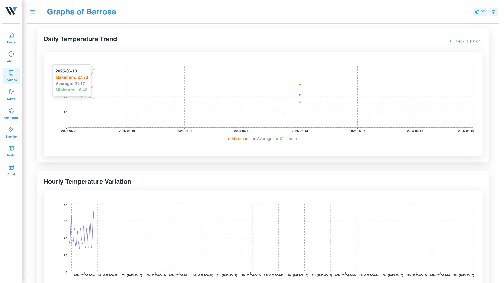 | 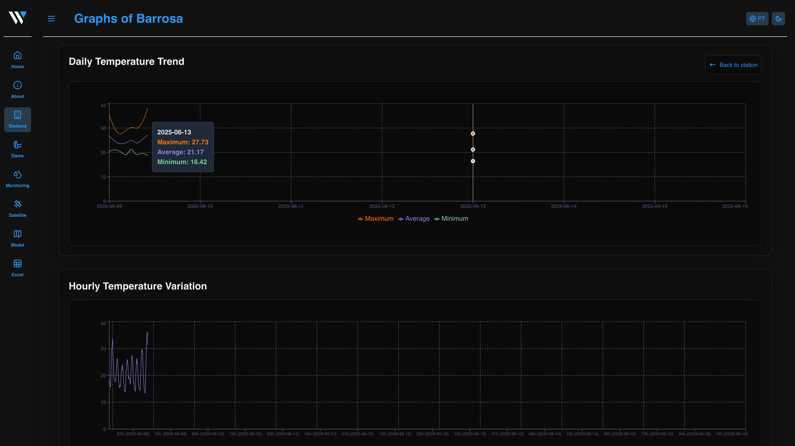 |

### Dams Overview Page

|                          Light Mode                          |                            Dark Mode                             |
| :----------------------------------------------------------: | :--------------------------------------------------------------: |
| 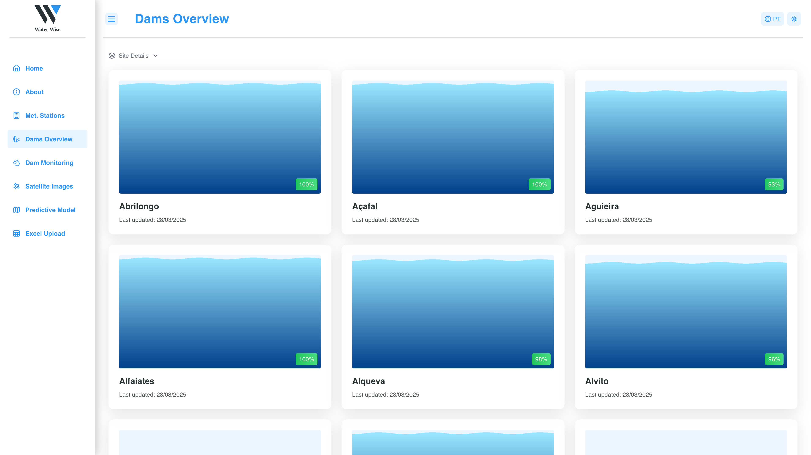 | 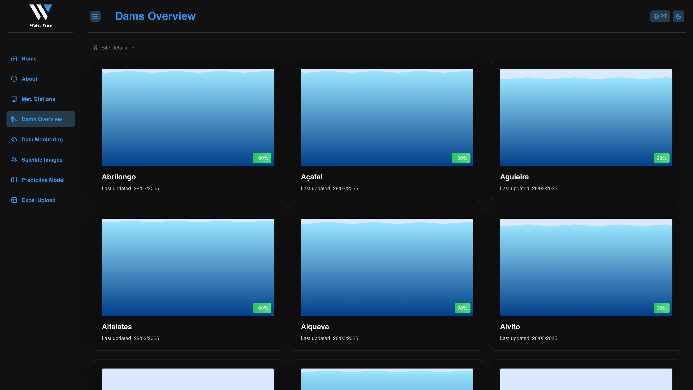 |

### Dam Page

|                Light Mode                |                  Dark Mode                   |
| :--------------------------------------: | :------------------------------------------: |
| 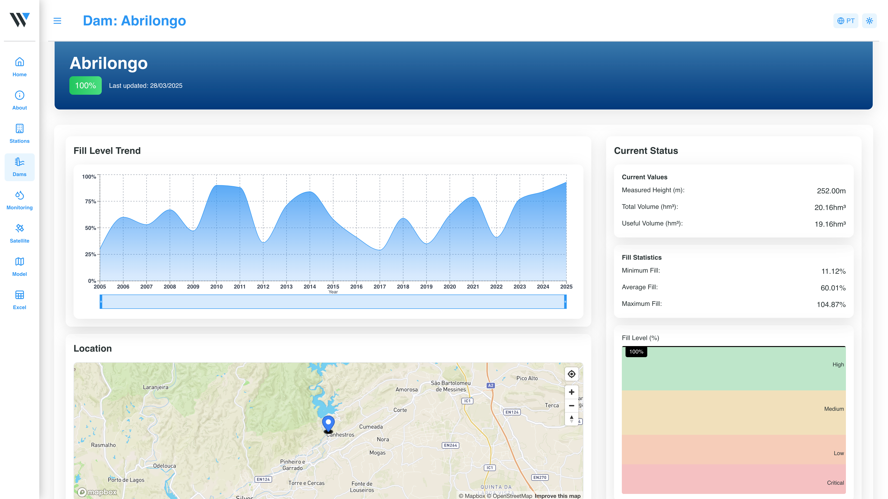 | 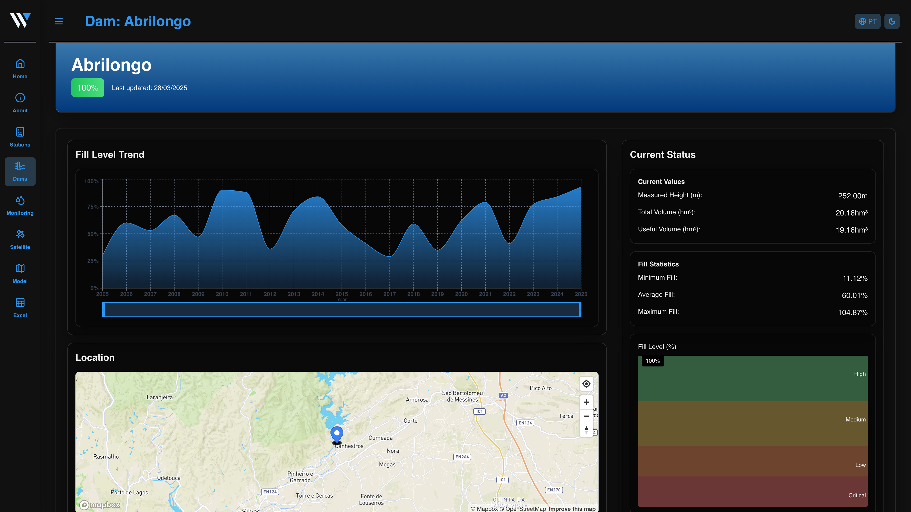 |

### Dam Monitoring Page

|                           Light Mode                           |                             Dark Mode                              |
| :------------------------------------------------------------: | :----------------------------------------------------------------: |
| 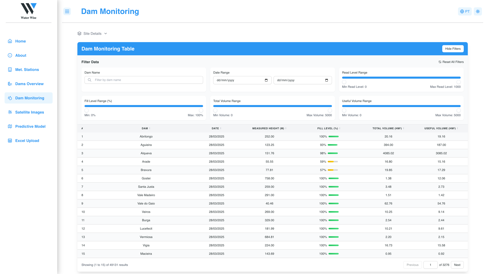 | 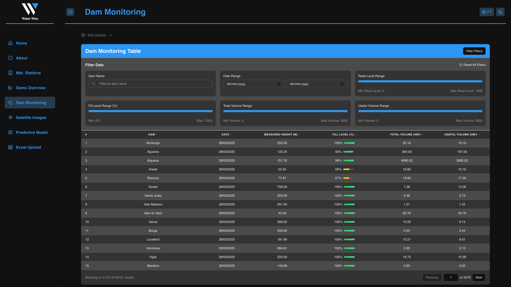 |

### Sattelite Images Page

|                             Light Mode                             |                               Dark Mode                                |
| :----------------------------------------------------------------: | :--------------------------------------------------------------------: |
|  |  |

### Predictive Model Page

|                             Light Mode                             |                               Dark Mode                                |
| :----------------------------------------------------------------: | :--------------------------------------------------------------------: |
| 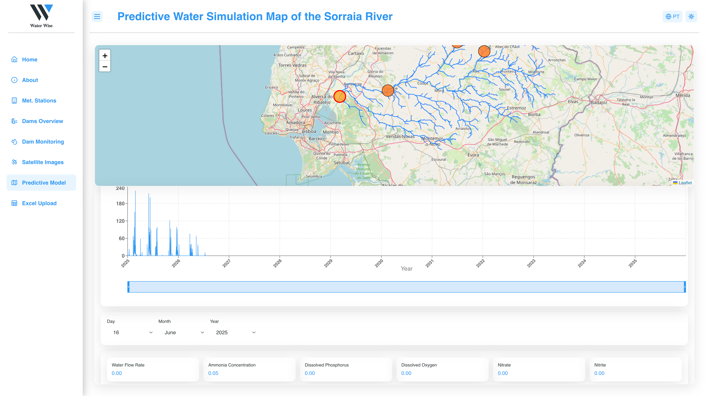 | 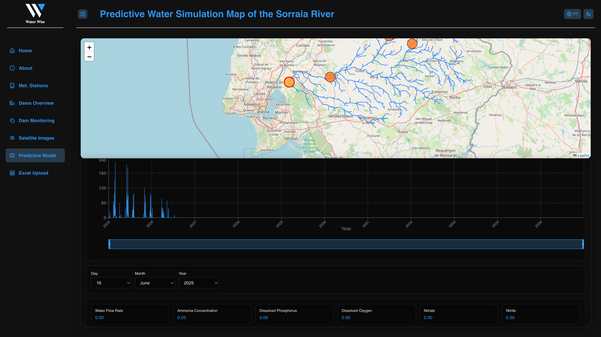 |

### Excel Page

|                  Light Mode                  |                    Dark Mode                     |
| :------------------------------------------: | :----------------------------------------------: |
| 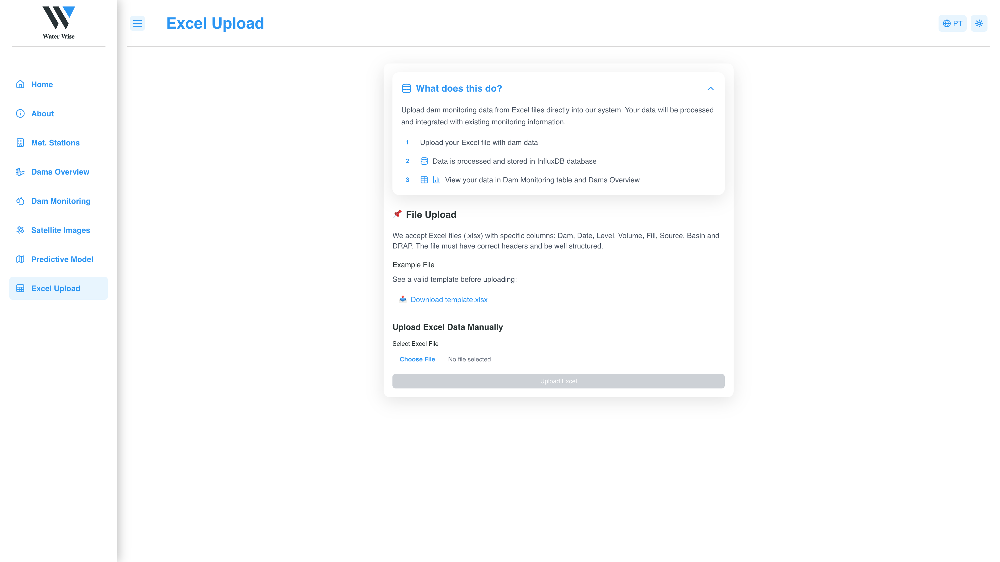 | 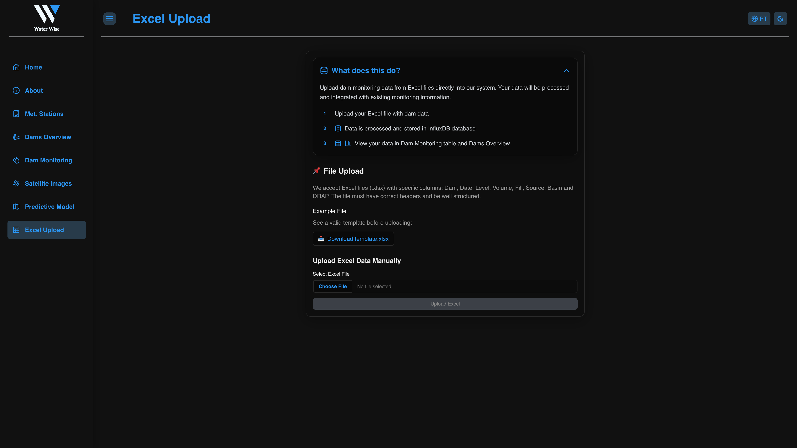 |

## Installation Setup

- In your terminal use "git clone (repository url)";
- Install all packages with "npm i";
- Update all Project Keys in your .env file;
- Run "npm run dev" to see the App localy;

## 👥 Team

- Ricardo Gonçalves – [a22208676] [Linkedin](https://www.linkedin.com/in/ricardo-gon%C3%A7alves-986780267/)
- Ricardo Piedade – [a22207722] [Linkedin](https://www.linkedin.com/in/ricardo-piedade-725485230/)
- Supervisor: Lúcio Studer
- Co-supervisor: Martim Mourão

## 🔗 Resources

- Figma Prototype: [Harmonia Prototype](https://www.figma.com/design/7Kn3rB2AwN8kPdtG6duN9Z/Water-Wise?node-id=0-1&t=61fUKdbJb8A0IdCy-1)
- Trello Board: [Agile Project Planning](https://trello.com/invite/b/670856b9dbf5bc06ae571810/ATTIe9c551671e6239455d8fea8069444804BA8A6106/water-wise)
